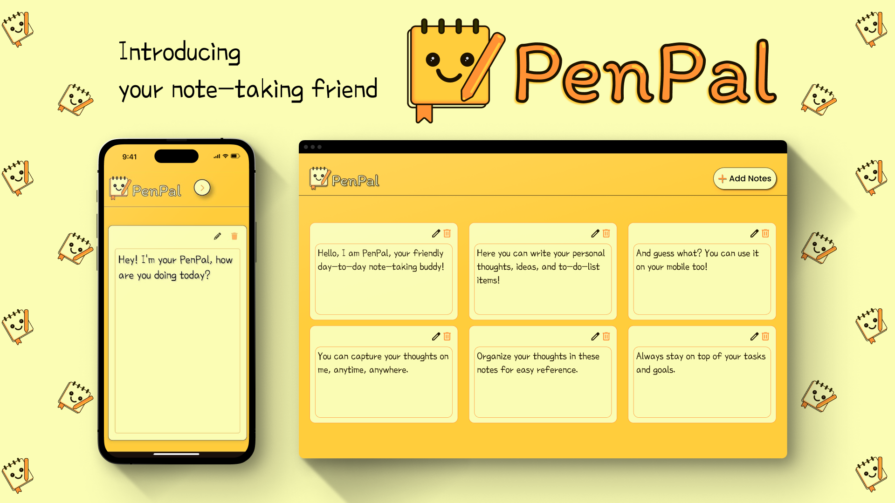
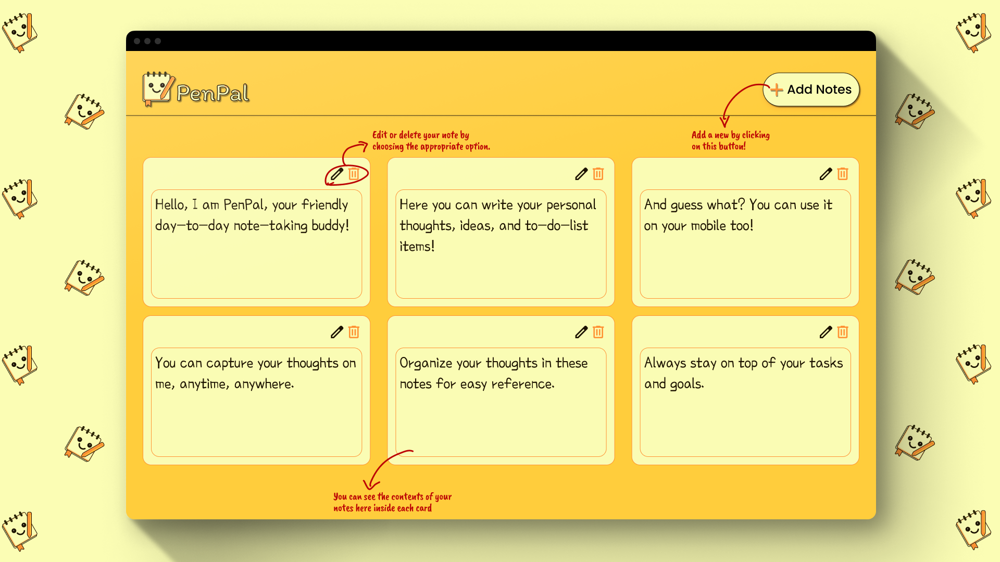

# PenPal:

  

#### PenPal is a mobile-first web app designed to be your go-to tool for capturing and organizing your thoughts, ideas, and to-do lists. 
It offers a simple and intuitive interface, making it easy to keep track of everything on the go.

#### Introduction:

Welcome to our project! This is a note-taking that allows users to quickly and easily add, delete, and update notes and lists (perform CRUD Operations). 
With this webapp, users can effortlessly manage , helping them stay organized and on top of their to-do list. We hope you enjoy and we look forward to your contributions!

#### Tech Stack:
- HTML5
- CSS3
- JavScript 

#### Why a notes taking app?

- 📸Capture your thoughts and ideas anytime, anywhere.
- 📝Organize your notes for easy reference.
- ⬆️Stay on top of your tasks and goals.

#### Features:

- ✏️ Create and edit notes: Jot down anything that comes to mind, from quick reminders to detailed ideas.
- ✨ Beauty in Simplicity: PenPal is designed to be visually pleasing and easy to navigate on any mobile device.
- 🔒 Secured Privacy: Since the notes taken are stored in local storage of the browser, it ensures that privacy of these notes is maintained and no one else can actually access them, even the creators ensuring complete privacy.

#### Getting Started:

- Download the .zip file (by clicking on Code --> Download .zip)of this repository to your system.
- Open PenPal on your mobile device's web browser.

 ####Screenshots:
  

- Tap the "Add Notes" button to create a new note.
- Type your note or to-do list items.
- You can also edit and delete existing notes by choosing the appropriate option on each note card.

We hope PenPal becomes your trusted companion for keeping your mind organized and productive!

#### Authors:

- [@upsydedown] https://github.com/upsydedown
- [@savvysapna] https://github.com/savvysapna

